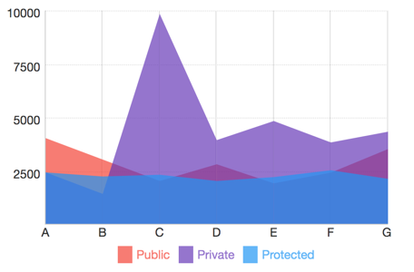
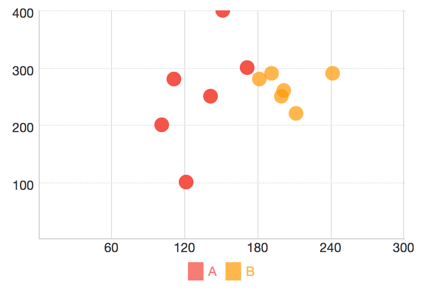

# Pre Charts

## Installation

```
npm install --save pre-charts
```

## AreaChart



```js
import AreaChart from "pre-charts/lib/AreaChart";
...

let data = [
    {name: "A", public: 4000, private: 2400, protected: 2400},
    {name: "B", public: 3000, private: 1398, protected: 2210},
    {name: "C", public: 2000, private: 9800, protected: 2290},
    ...
];

let meta = [
    {dataKey: "public", name: "Public", unit: "piece", fill: "#F44336"},
    {dataKey: "private", name: "Private", unit: "piece", fill: "red"},
    {dataKey: "protected", name: "Protected", unit: "piece", fill: "blue"}
];
...

<AreaChart data={data} width={400} height={250} meta={meta}/>

```

## BarChart


```js
import BarChart from "pre-charts/lib/BarChart";
...

let data = [
    {name: "A", public: 4000, private: 2400, protected: 2400},
    {name: "B", public: 3000, private: 1398, protected: 2210},
    {name: "C", public: 2000, private: 9800, protected: 2290},
    ...
];

let meta = [
    {dataKey: "public", name: "Public", unit: "piece", fill: "blue"},
    {dataKey: "private", name: "Private", unit: "piece", fill:"#F44336"},
    {dataKey: "protected", name: "Protected", unit: "piece", fill: "red"}
];
...

<BarChart data={data} width={400} height={250} meta={meta}/>

```

## LineChart


```js
import LineChart from "pre-charts/lib/LineChart";
...

let data = [
    {name: "A", public: 4000, private: 2400, protected: 2400},
    {name: "B", public: 3000, private: 1398, protected: 2210},
    {name: "C", public: 2000, private: 9800, protected: 2290},
    ...
];

let meta = [
    {dataKey: "public", name: "Public", unit: "piece", fill:"red"},
    {dataKey: "private", name: "Private", unit: "piece", fill:"blue"},
    {dataKey: "protected", name: "Protected", unit: "piece", fill:"yellow"}
];
...

<LineChart data={data} width={400} height={250} meta={meta}/>

```


## ScatterChart




```js
import ScatterChart from "pre-charts/lib/ScatterChart";
...

const dataA = [
    {x: 100, y: 200, z: 200},
    {x: 120, y: 100, z: 260},
    {x: 170, y: 300, z: 400},
    {x: 140, y: 250, z: 280},
    {x: 150, y: 400, z: 500},
    {x: 110, y: 280, z: 200},
    {x: 100, y: 200, z: 200},
    {x: 120, y: 100, z: 260},
    {x: 170, y: 300, z: 400},
    {x: 140, y: 250, z: 280},
    {x: 150, y: 400, z: 500},
    {x: 110, y: 280, z: 200}
];

const dataB = [
    {x: 200, y: 260, z: 240},
    {x: 240, y: 290, z: 220},
    {x: 190, y: 290, z: 250},
    {x: 198, y: 250, z: 210},
    {x: 180, y: 280, z: 260},
    {x: 210, y: 220, z: 230}];

const data = [
    {name: "A", data: dataA},
    {name: "B", data: dataB}
];

let meta = [
    {dataKey: "x", unit: "cm", name: "X", fill:"#F44336"},
    {dataKey: "y", unit: "cm", name: "Y", fill:"red"},
    {dataKey: "z", unit: "cm", name: "Z", fill:"blue"}
];

...

<ScatterChart data={data} width={400} height={250} meta={meta}/>

```


## PieChart


```js
import PieChart from "pre-charts/lib/PieChart";
...

let data = [
    {
        value: 1500,
        label: "A",
        key: "0",
        unit: "ms",
        fill:"#2196F3"
    },
    {
        value: 2500,
        label: "B",
        key: "1",
        unit: "ms",
        fill:"#F44336"
    },
    {
        value: 3000,
        label: "C",
        key: "3",
        unit: "ms",
        fill:"red"
    }
];

...

<PieChart size={200} data={data}/>

```

### Quick Start

#### 1. Get the latest version
You can start by cloning the latest version of pre-charts.

#### 2. Run `npm install`
This will install both run-time project dependencies and developer tools listed
in [package.json](./package.json) file.

#### 3. How to start project in Development Mode

This will start the development server and serve site application.

```shell
$ npm start
```
  
Open Browser and enter `http://localhost:3000` (default) 

### How to Build for Production

If you need just to build the app (without running a dev server), simply run:

```shell
$ npm run build
```

### How to Build for Site

If you need just to build the app (without running a dev server), simply run:

```shell
$ npm run site
```
